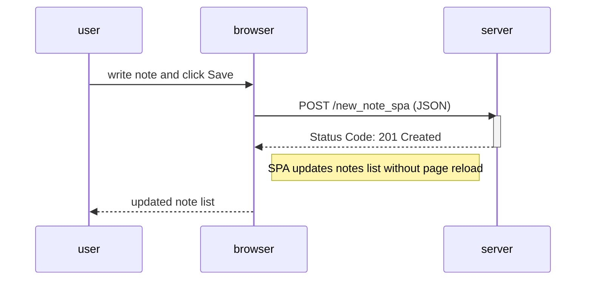

```mermaid

sequenceDiagram
    participant user
    participant browser
    participant server

    user->>browser: write note and click Save
    
    browser->>server: POST /new_note_spa (JSON)
    activate server
    server-->>browser: Status Code: 201 Created
    deactivate server

    Note right of browser: SPA updates notes list without page reload

    browser-->>user: updated note list

```